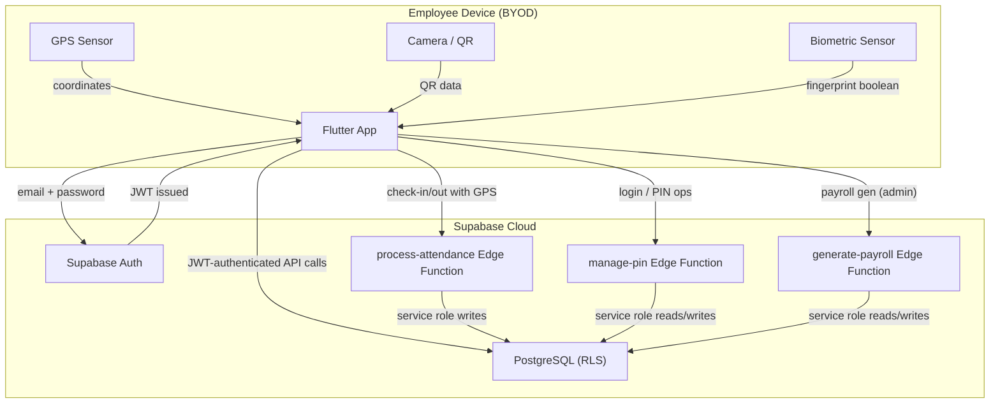

# Threat Model — Visual Time (vt_app)

## Executive Summary

Visual Time is a Flutter + Supabase attendance and payroll management application deployed as a single-tenant system for an event management company with 10–15 employees. Employees use personal Android devices (BYOD, no MDM). The app handles attendance GPS coordinates, leave records, advance salary, payroll amounts, and bank account numbers — all of which are PII or financially sensitive.

**Top risk themes:**
1. **Attendance integrity is only recently hardened** — an Edge Function now validates GPS server-side, but the previous client-only design (still present in git history and deployment history) means any check-in/out records created before the fix are unverifiable.
2. **PIN-as-password with client-orchestrated rate limiting** — the anti-brute-force mechanism can be bypassed by calling the Supabase Auth API directly, which has no knowledge of the custom rate limit.
3. **BYOD + rooted device exposure** — the biometric toggle and session token are protected only by SharedPreferences (unencrypted), enabling persistence bypass on compromised devices.
4. **Static QR code with embedded GPS coordinates** — the office QR never rotates, so a single photograph grants permanent replay capability and leaks office location.

---

## Scope and Assumptions

### In scope
- `lib/` — all Dart application code
- `supabase/functions/` — Edge Functions (TypeScript)
- `supabase/migrations/` — PostgreSQL schema and RLS policies
- `android/app/src/main/` — Android manifest, splash screen, permissions
- Supabase Auth, PostgreSQL, REST API, and Edge Functions as deployed

### Out of scope
- Physical security of devices or office
- Network-level attacks (Wi-Fi eavesdropping — assumes TLS)
- Social engineering of administrators
- Third-party package supply chain (Flutter pub.dev, npm for Deno)

### Assumptions (confirmed by project owner)

| # | Assumption | Detail |
|---|---|---|
| A1 | Single-tenant, internal use | One Supabase project, one company, 10–15 employees |
| A2 | BYOD, no MDM | Rooted devices, SharedPreferences tampering, APK reverse engineering, runtime instrumentation are **in scope** |
| A3 | No file uploads | Only structured data: profiles, attendance, GPS, leave, advance, payroll, bank accounts |
| A4 | Supabase anon key is public | By design — embedded in APK, visible in decompiled code |
| A5 | Internet required | No offline mode; all operations require Supabase connectivity |

---

## System Model

### Primary Components

| Component | Description | Language/Runtime | Evidence |
|---|---|---|---|
| **Flutter Client** | Mobile app installed on employee Android devices. Handles UI, QR scanning, GPS collection, biometric prompt | Dart 3.4+, Flutter 3.44.7 | `lib/main.dart` |
| **Supabase Auth** | User authentication (email/password, anon). Issues JWTs | Supabase managed | `auth_provider.dart` |
| **PostgreSQL (Supabase)** | 11 tables with RLS. Stores all business data | PostgreSQL 15 | `supabase/migrations/` |
| **manage-pin Edge Function** | PIN lookup, rate-limited PIN reset, employee user creation | TypeScript / Deno | `supabase/functions/manage-pin/index.ts` |
| **generate-payroll Edge Function** | Server-side payroll calculation | TypeScript / Deno | `supabase/functions/generate-payroll/index.ts` |
| **process-attendance Edge Function** | Server-side GPS/geofence validation for check-in/out | TypeScript / Deno | `supabase/functions/process-attendance/index.ts` |

### Data Flows and Trust Boundaries

```
Internet → Supabase Auth: Login credentials (email, PIN as password)
  → Auth boundary (JWT issued)

Flutter Client → Supabase REST API: All CRUD operations (authenticated with JWT)
  → RLS boundary (SQL row-level policies)

Flutter Client → Supabase Edge Functions: Check-in/out, PIN management, payroll generation
  → Service role boundary (Edge Functions use service key, bypass RLS)

Flutter Client → Device GPS sensor: Location for check-in validation
  → Trust boundary (GPS is user-controlled on rooted devices)

Flutter Client → Device camera: QR code scanning
  → Trust boundary (scan result processed locally)

Supabase Edge Functions → PostgreSQL: Service-role writes (bypasses RLS)
  → Trust boundary (Edge Function JWT validation checked, but once inside, full access)

Admin App → Employee CRUD: PIN reset, salary configuration
  → Admin boundary (GoRouter checks admin role app-side; RLS enforces server-side)
```

#### Mermaid Diagram



---

## Assets and Security Objectives

| Asset | Why It Matters | Objective (C/I/A) |
|---|---|---|
| Employee bank account numbers | Direct financial PII; if leaked, can be used for fraud | Confidentiality |
| Salary and payroll data | Personal financial information; intra-company visibility is a privacy violation | Confidentiality, Integrity |
| GPS location history | Reveals employee movement patterns; sensitive PII | Confidentiality |
| Attendance records | Drive payroll calculations; forged attendance = payroll fraud | Integrity |
| Auth tokens (JWT) | Grant access to all data the user can see | Confidentiality, Integrity |
| PIN / password (shared Secret) | Single-factor auth; compromised credentials = full account access | Confidentiality |
| Company settings (GPS coordinates, radius) | If modified by attacker, geofencing becomes ineffective | Integrity |
| Supabase service role key | Full database access — stored only as environment variable on Supabase infrastructure | Confidentiality |

---

## Attacker Model

### Capabilities
- Can install the official APK on a personal device
- Can reverse-engineer the APK (e.g., `apktool`, `jadx`) to read hardcoded strings (Supabase URL, anon key)
- Can instrument the app at runtime (Frida, Objection) or tamper with local storage on a rooted device
- Can make HTTP requests to Supabase REST API and Edge Function endpoints directly (the anon key and URL are public)
- Can photograph the office QR code once and reuse it indefinitely
- Can guess or brute-force employee PINs (4–6 digit numeric)
- Can submit leave, advance requests as any employee if they obtain that employee's JWT

### Non-capabilities
- Cannot access Supabase project settings or Supabase Dashboard (separate admin auth)
- Cannot read PostgreSQL directly (no direct DB access from outside)
- Cannot execute arbitrary SQL or upload files
- Cannot eavesdrop on TLS-secured API traffic (assuming standard network security)
- Cannot forge Edge Function responses (Edge Functions run on Supabase infrastructure)

---

## Entry Points and Attack Surfaces

| Surface | How Reached | Trust Boundary | Notes | Evidence |
|---|---|---|---|---|
| **Employee login** | Employee code + PIN → Supabase Auth | Internet → Auth | PIN is 4+ digit numeric, padded with `vt` as password | `auth_provider.dart` |
| **Admin login** | Email + password → Supabase Auth | Internet → Auth | Standard email/password | `auth_provider.dart` |
| **QR check-in** | Scan QR → client validates → calls Edge Function | Device → Cloud | Client-side QR decode, server-side GPS validation in Edge Function | `qr_provider.dart`, `process-attendance/index.ts` |
| **Manual check-in (app button)** | User taps check-in → GPS → Edge Function | Device GPS → Cloud | Same validation path as QR | `attendance_provider.dart` |
| **Check-out** | User taps check-out → GPS → Edge Function | Device GPS → Cloud | Same validation | `attendance_provider.dart` |
| **Leave submission** | Employee submits leave form → Supabase REST API | Device → Cloud via REST | Client-side JWT auth, RLS enforces `auth.uid() = employee_id` | `employee_leave_request_screen.dart` |
| **Leave approval** | Admin approves → Supabase REST API | Device → Cloud via REST | RLS enforces `is_admin()` | `admin_leave_approval_screen.dart` |
| **Advance request** | Employee submits → Supabase REST API | Device → Cloud via REST | RLS enforces own-row | `employee_advance_request.dart` |
| **Salary config** | Admin sets config → Supabase REST API | Device → Cloud via REST | RLS enforces `is_admin()` | `admin_salary_config.dart` |
| **Payroll generation** | Admin triggers → Edge Function | Device → Edge Function | Edge Function verifies admin role via JWT | `admin_payroll_dashboard.dart`, `generate-payroll/index.ts` |
| **Direct Supabase REST API** | Any HTTP client with anon key | Internet → Database | Anon key is public; RLS is the only gate | `constants.dart` |
| **Forgot PIN** | Tappable link → shows info dialog | Device only | No API call — purely informational | `login_screen.dart` |

---

## Top Abuse Paths

### AP-1: Attendance Forgery (Pre-Fix Records)
1. Attacker extracts Supabase URL and anon key from decompiled APK
2. Queries `attendance` table via REST for any earlier date
3. Older records (created before the `process-attendance` Edge Function was deployed) have no server-side validation proof
4. **Impact:** Existing attendance records cannot be cryptographically verified; payroll disputes relying on pre-fix data are unresolvable

### AP-2: PIN Brute-Force Bypass via Direct Auth API
1. Attacker obtains an employee code (e.g., "EMP7777")
2. Calls `POST https://project.supabase.co/auth/v1/token?grant_type=password` directly with guessed PIN + `vt` suffix
3. Supabase Auth's native endpoint is not rate-limited by the custom Edge Function
4. **Impact:** Employee account compromised; attacker can view salary, bank details, GPS history, submit fraudulent leave/advance requests

### AP-3: Biometric Bypass on Rooted Device
1. Attacker gains root access to employee's Android device
2. Reads `SharedPreferences` XML file at `/data/data/com.vtapp.vt_app/shared_prefs/`
3. Sets `biometric_enabled` to `false`
4. Next app launch shows login screen instead of biometric prompt
5. **Impact:** If device is unlocked/lost, anyone can access the app without biometric challenge

### AP-4: Static QR Code Replay + Location Leak
1. Attacker photographs the office QR code posted at the office entrance
2. QR decodes to `{"co":"visual_time","la":12.34,"lo":56.78}`
3. Attacker can fabricate check-ins from any location (if they bypass the Edge Function, which would reject out-of-range GPS)
4. Even with Edge Function protection, the QR leaks precise office GPS coordinates to anyone who has seen it
5. **Impact:** Office location exposed; old QR-based check-ins are unverifiable if Edge Function was not always in place
6. **Current Edge Function mitigates this for new check-ins** — it validates GPS server-side, but the static QR nature means no origin binding

### AP-5: Salary Components Leak (Now Fixed)
1. Before the security migration (20240101000011), an employee could query `salary_components` table directly via REST
2. This returned every employee's `health_insurance`, `professional_tax`, and `tds` amounts
3. **Impact:** Personal tax information leaked between coworkers
4. **Status:** Fixed — RLS now scopes to own row

### AP-6: Admin Session on Unattended Device
1. Admin logs in on their device and leaves it unattended
2. No inactivity/session timeout is enforced by the app
3. Anyone with physical access to the unlocked device can approve leave, advance, generate payroll, change settings
4. **Impact:** Privileged operations performed without consent

---

## Threat Model Table

| Threat ID | Threat Source | Prerequisites | Threat Action | Impact | Impacted Assets | Existing Controls (Evidence) | Gaps | Recommended Mitigations | Detection Ideas | Likelihood | Impact Severity | Priority |
|---|---|---|---|---|---|---|---|---|---|---|---|---|
| TM-001 | External attacker | APK decompilation, anon key extraction | Direct REST API calls to query employee data, bypassing client-side validation | Confidentiality breach — all employee data readable | Profiles, attendance, leave, payroll, bank accounts | RLS on all 11 tables (`supabase/migrations`). Edge Function validates check-in/out server-side | RLS cannot distinguish between app-originated and direct REST calls. Employee still has SELECT access to own data via REST. Biometric bypass on rooted device | Move attendance write operations entirely to Edge Function (done). Next: move all write operations through Edge Functions with server-side authorization checks, leaving RLS as defense-in-depth | Monitor Supabase API logs for unusual query patterns (high query volume, non-app user agents) | Medium | High | **High** |
| TM-002 | External attacker | Employee code, PIN guess | Direct Supabase Auth API call with guessed PIN to bypass client-orchestrated rate limiting | Full account takeover — view salary/bank data, submit fraudulent requests | Auth tokens, employee PII | `check-login-attempt` Edge Function call in `employeeCodeSignIn()`. Lockout at 5 attempts / 30 min stored in `auth.users.user_metadata` | Supabase Auth API has no awareness of the custom rate limit. Attacker can call `auth/v1/token` directly | 1. Enable Supabase's project-level auth rate limiting. 2. Increase minimum PIN length to 6 digits. 3. Move PIN authentication entirely to an Edge Function that issues a short-lived Supabase token after rate-limited server-side validation (removing the direct auth bypass path entirely) | Monitor Supabase Auth logs for failed login spikes across multiple employee codes | High | High | **Critical** |
| TM-003 | Local attacker (physical access) | Rooted/jailbroken device, unlocked screen | Modify SharedPreferences to disable biometric gate, or extract JWT from app storage | Persistent session access on unattended/lost device | Auth tokens, all employee data visible to that user | Biometric gate (`biometric_screen.dart`). JWT stored by Supabase client internally | SharedPreferences is unencrypted XML (`biometric_enabled` flag). No app-level inactivity timeout. JWT refresh token is in Supabase client storage (default) | 1. Store biometric flag in `flutter_secure_storage` (Android Keystore-backed). 2. Implement inactivity timeout (re-require PIN/biometric after N minutes backgrounded). 3. Consider remote session invalidation endpoint | Log successful biometric unlocks vs password entries; flag sessions from unexpected device/network | Medium | High | **High** |
| TM-004 | External attacker, insider | Photograph/QR code access | Reuse static QR code for replay or extract office GPS coordinates | GPS coordinates leaked; ability to construct valid-appearing QR data | Office location PII, attendance integrity | Edge Function now validates GPS server-side (`process-attendance/index.ts`). QR `co` field validated against company name | QR content is static and non-expiring. Office coordinates are embedded in the QR and cannot be server-validated as authentic (anyone can generate a QR with correct coords) | 1. Make QR content time-boxed (server-minted token with expiry, validated by Edge Function). 2. Remove GPS coordinates from QR payload — let server look up office location from `company_settings` | Alert on check-ins using a QR token older than N minutes; flag repeated GPS coordinates | Medium | Medium | **Medium** |
| TM-005 | External attacker | Employee ID, no authentication | Query `leave_balance` or `leave_requests` via REST with valid JWT (any employee) | View coworkers' leave balance and history | Leave records, PII | RLS policies on `leave_requests`: employees read own, admins read all. Same for `leave_balance` | RLS is correctly configured for these tables | (Already mitigated — maintain current RLS) | N/A | Low | Medium | **Low** |
| TM-006 | Insider (employee) | Valid employee JWT | Submit leave request without sufficient balance (bypass client-side check by calling API directly) | Employee takes more leave than entitled | Leave balance integrity | Server-side balance check in `employee_leave_request_screen.dart`: `hasLeaveBalance()` is called before submit. RLS does not prevent insert with insufficient balance | The balance check is in the client-side service call, not enforced server-side via DB constraint or trigger | Add a PostgreSQL trigger or CHECK constraint that rejects leave inserts when `used_days + requested_days > total_days` for the given year/type. Or move leave submission to an Edge Function | Compare approved leave days against balance at payroll time | Medium | Medium | **Medium** |
| TM-007 | Insider (admin) | Admin JWT | Admin abuses privilege to manipulate salary/payroll data | Salary/Payroll fraud | Salary history, payroll records, advance records | All salary/payroll/advance tables have RLS requiring `is_admin()` for writes. Payroll generation via Edge Function also checks admin role | No secondary approval for payroll finalization. One admin can generate, review, and approve the same payroll record solo | Require two-admin approval for payroll "Approve" step (separate from "Review"). Log every admin salary/payroll change to `admin_audit_log` | Audit log review for solo approve-then-approved sequences | Low | High | **Medium** |
| TM-008 | External attacker | None (pre-fix) | Pre-mitigation exploitation of `salary_components` world-readable policy | Tax data of all employees leaked | Salary components PII | Now fixed in migration `20240101000011` — RLS scoped to own row | — | (Already mitigated) | — | Low (past) | High | **N/A (fixed)** |

---

## Criticality Calibration

| Level | Definition | Examples |
|---|---|---|
| **Critical** | Allows unauthenticated or minimally-gated access to sensitive data, or defeats a core security boundary with realistic attacker prerequisites | Direct Auth API bypass of PIN rate limiting (TM-002) |
| **High** | Enables privilege escalation, persistent unauthorized access on a compromised device, or mass data exfiltration with moderate attacker prerequisites | Attendance forgery via REST (TM-001), biometric bypass on rooted device (TM-003) |
| **Medium** | Enables limited data access or system integrity violation with significant attacker prerequisites or limited blast radius | QR replay + location leak (TM-004), leave balance bypass (TM-006), single-admin payroll fraud (TM-007) |
| **Low** | Requires unlikely prerequisites or exposes low-sensitivity information | Reading coworkers' leave history (TM-005) |

---

## Focus Paths for Security Review

| Path | Why It Matters | Related Threat IDs |
|---|---|---|
| `lib/features/authentication/providers/auth_provider.dart` | Contains the PIN-to-password conversion and the client-orchestrated rate limiting flow — the root cause of TM-002 | TM-002 |
| `supabase/functions/process-attendance/index.ts` | Server-side attendance validation — correctness of the geofence check determines whether TM-004 is mitigated | TM-001, TM-004 |
| `supabase/functions/manage-pin/index.ts` | Contains all PIN operations including rate limiting and user creation. The `create-user` action is a powerful admin-only endpoint | TM-002, TM-007 |
| `lib/features/authentication/views/biometric_screen.dart` | Biometric gate — currently protected only by SharedPreferences flag | TM-003 |
| `lib/features/qr/views/qr_display_screen.dart` | QR generation — static content with embedded GPS coordinates | TM-004 |
| `supabase/migrations/20240101000009_rls_policies.sql` | RLS policies for all tables — correctness review to ensure no "Anyone reads" policies remain | TM-001, TM-005, TM-007 |
| `lib/core/utils/logger.dart` | Logging utility — verify no sensitive data is logged (PINs, tokens) | TM-001, TM-002 |
| `lib/main.dart` | App entry point — verify `runZonedGuarded`, FlutterError, and PlatformDispatcher error handlers | TM-003 |

---

## Notes

- **Pre-fix attendance records** cannot be cryptographically verified. The `process-attendance` Edge Function was introduced mid-development, so any check-in/out record created before its deployment lacks server-side validation proof. For production launch, consider a one-time migration to re-validate attendance history.
- **Supabase anon key** is deliberately public (embedded in every APK). This is standard for Supabase/Firebase architectures. The security boundary relies entirely on RLS and JWT authentication.
- **Service role key** is never hardcoded in the source — it is set as a Supabase Edge Function environment variable. This is the correct approach.
- **No audit trail for employee-session actions** — leave submissions, advance requests, and attendance records are not logged to `admin_audit_log` (that table records only admin actions). Consider adding employee audit logging for compliance.
- **The `process-attendance` Edge Function** uses a hardcoded Haversine formula that matches the client-side `location_service.dart` implementation. Both should be kept in sync. The Edge Function is the authoritative validator.
